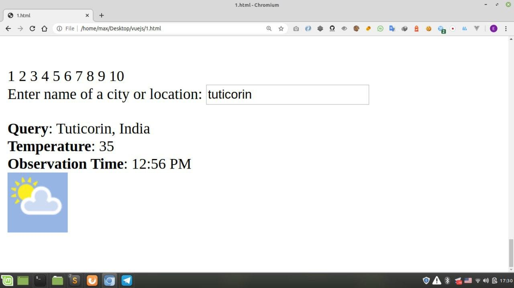

# First VueJS (Javascript)

Sample web page using vuejs just for fun.

Good example for starter and learning Vue Js easily and fastly. (Just in 10 minutes)

---------

# Max Base

My nickname is Max, Programming language developer, Full-stack programmer. I love computer scientists, researchers, and compilers. ([Max Base](https://maxbase.org/))

## Asrez Team

A team includes some programmer, developer, designer, researcher(s) especially Max Base.

[Asrez Team](https://www.asrez.com/)
